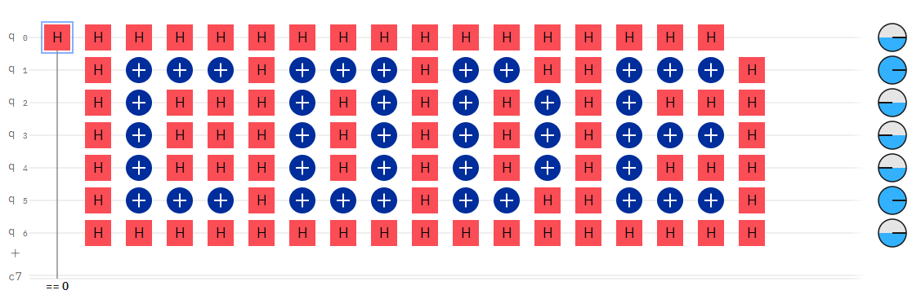

# QASM: A Quantum Programming Language  
QASM originated as a language for formally defining a quantum circuit to render images for visualization purposes. As quantum computation evolved, the language was adopted as a way to specify quantum circuits as input to a quantum computer. 
cr. https://www.quantum-inspire.com/kbase/cqasm/ 
